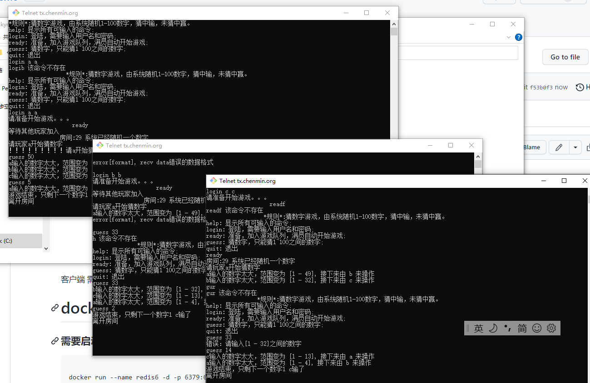

# skynet-demo

windows 下

启动redis，服务器的redis配置文件在test\service\redis.lua,根据具体情况修改

server.bat 启动服务器

client.bat 启动客户端

客户端 需要启动3个


# docker 启动

### 需要启动redis
```

docker run --name redis6 -d -p 6379:6379 redis:6.0.1-alpine3.11 --requirepass XXXXXX

```

### 需要启动chenmins/skynet

 
[github.com/chenmins/skynet](https://github.com/chenmins/skynet/blob/docker/Dockerfile)

```
docker run -it --rm -v /root/skynet-test-cpy:/skynet/script \
-v /root/skynet-test-cpy/test:/skynet/test \
-p 8888:8888 \ 
chenmins/skynet /skynet/script/config.test2
```

